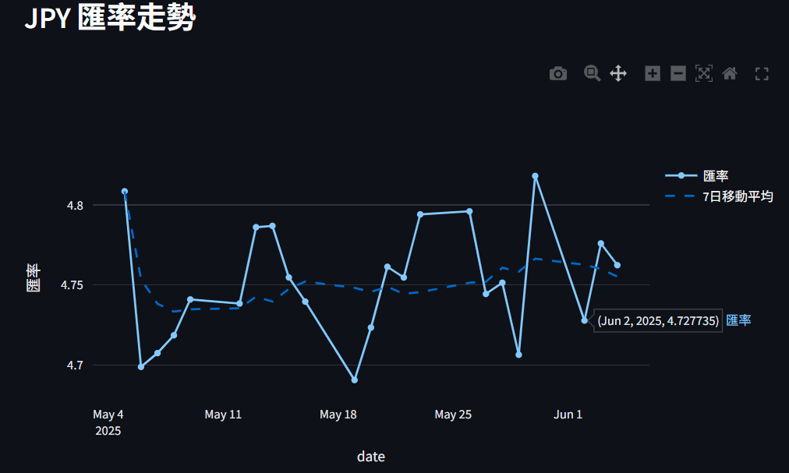
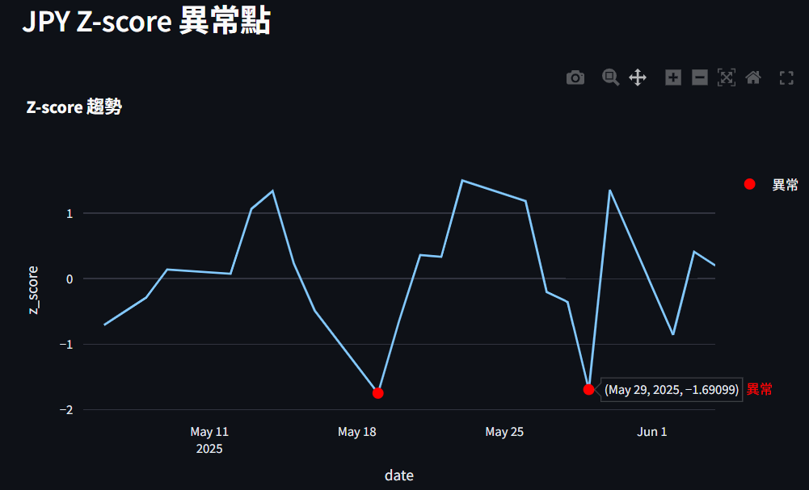
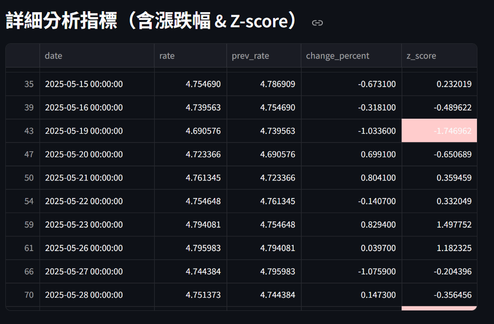

# Exchange Rate Analysis Project

本專案使用 Python、Airflow、Spark、PostgreSQL 建立每日匯率資料的 ETL 與分析流程，並透過 Streamlit 製作資料視覺化介面。主要功能包含：

- Airflow 排程每日自動執行完整流程，包括：
    - Extract: 從 API 抓取匯率資料（TWD 對 USD、EUR、JPY、GBP）
    - Transform: 使用 Pandas 清洗與轉換資料
    - Load: 儲存原始與轉換後資料到 PostgreSQL
    - 分析：觸發 Apache Spark 進行資料分析，包括：計算 7 日移動平均與波動率（標準差）、計算 Z-score 異常指標與每日漲跌幅

- Streamlit 建立互動式 Dashboard：
    - 可選擇幣別與日期範圍，查看匯率趨勢與分析指標
---

## 目錄
- [1. 專案架構](#1-專案架構)
- [2. 環境設定](#2-環境設定)
- [3. 執行流程](#3-執行流程)

## 1. 專案架構

```
exchange_rate_project/
├── airflow/                
│   └── dags/               
│       └── currency_dag.py   # Airflow DAGs 設定檔
├── dashboard/              
│   └── app.py                # Streamlit 分析 Dashboard
├── db/                     
│   └── schema.sql            # 建立資料表用的 SQL 指令
├── spark_jobs/            
│   └── spark_analysis.py     # 使用 Spark 進行分析
├── scripts/                  # ETL 程式碼（extract/transform/load）
│   ├── extract.py            # 以 pandas 處理匯率 API
│   ├── transform.py
│   └── load.py
├── jars/                     
│   └── postgresql-42.6.0.jar # Spark 連接 PostgreSQL 所需的 .jar 檔
├── .env                      # 環境變數設定檔
├── requirements.txt          # Python 套件需求
└── README.md
```

## 2. 環境設定
注意：Airflow 不建議直接在 Windows 上執行，建議使用 Ubuntu/Linux 環境，或透過 WSL / Docker 安裝。

### 2.1 安裝 python 套件：

```bash
pip install -r requirements.txt
```

### 2.2 初始化 PostgreSQL 資料庫

```bash
# 安裝 PostgreSQL
sudo apt update
sudo apt install postgresql

# 啟動 PostgreSQL
sudo service postgresql start  

# 用 psql 登入 PostgreSQL
sudo -u postgres psql

# 建立資料庫
CREATE DATABASE exchange_rate_db;
ALTER USER postgres WITH PASSWORD 'your_password';
\q  # 退出 psql

# 建立資料表 (schema)
psql -h localhost -U postgres -d exchange_rate_db -f db/schema.sql
```
PS. 也可以透過 pgAdmin 圖形介面管理資料庫：在 pgAdmin 中建立連線，並輸入 Ubuntu / WSL 的 IP 位址與 PostgreSQL 登入資訊。


### 2.3 建立 `.env` 檔（存放 DB 連線資訊）：

```env
PG_HOST=localhost
PG_PORT=5432
PG_DATABASE=exchange_rate_db
PG_USER=postgres
PG_PASSWORD=yourpassword
```

### 2.4 初始化 Airflow
```bash
# 建立 Airflow 資料夾與設定環境變數：
export AIRFLOW_HOME=$(pwd)/airflow
export AIRFLOW__CORE__DAGS_FOLDER=$(pwd)/airflow/dags

# 初始化 metadata databas
airflow db migrate  # Airflow 2.7+ 使用 migrate
airflow db init     # Airflow 2.6 或更早版本請改用 init
```
此步驟會建立 metadata database，Airflow 用來記錄 DAG 狀態與任務記錄等資訊。

### 2.5 安裝 Java (為了執行 Spark 使用)
```bash
# 安裝 OpenJDK 17
sudo apt update
sudo apt install openjdk-17-jdk

# 查詢 Java 安裝路徑
readlink -f $(which java)
# 範例輸出：/usr/lib/jvm/java-17-openjdk-amd64/bin/java

# 根據上面的路徑設定 JAVA_HOME
export JAVA_HOME=/usr/lib/jvm/java-17-openjdk-amd64
```

## 3. 執行流程

### 3.1 啟動 Airflow

```bash
airflow standalone # 啟動啟動 Scheduler + Webserver
```
Airflow Web UI：http://localhost:8080  
此指令會自動產生一組預設的帳號密碼 admin / password，可透過以下指令查詢密碼檔案：
```bash
cat ~/exchange_rate_project/airflow/simple_auth_manager_passwords.json.generated
```

### 3.2 啟用 ETL + 分析流程

進入 Airflow UI，啟用 `currency_etl_dag` DAG（可透過 `airflow/dags/currency_dag.py` 更改排程時間），便會依序執行以下流程：

- 抓取匯率資料：`scripts/extract.py`
- 清洗轉換欄位：`scripts/transform.py`
- 寫入原始資料表 `exchange_rates`：`scripts/load.py`
- 執行 Spark 分析移動平均、波動率等指標：`spark_jobs/spark_analysis.py`
- 將分析結果寫入 `exchange_rate_analysis` 資料表

### 3.3 Streamlit Dashboard

執行：

```bash
streamlit run dashboard/app.py
```
Dashboard Web UI： http://localhost:8501

可透過下拉選單選擇幣別，呈現以下內容：匯率趨勢與 7 日移動平均圖、Z-score 異常點視覺化、各日期詳細統計指標表格






